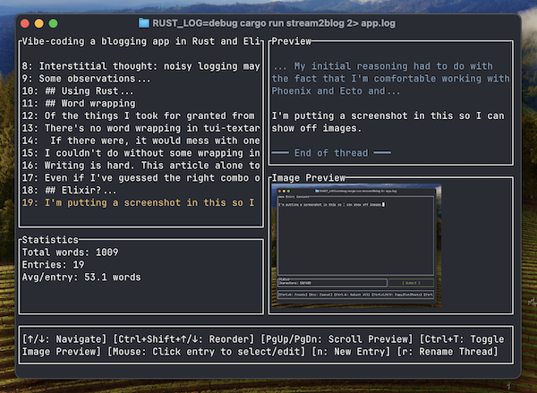

# Stream2Blog: a text-based user interface for microblogging into a macroblog

There is a Rust-based UI built on [Ratatui](https://ratatui.rs/), backed by an Elixir/Phoenix/SQLite storage app. It works on my machine. (MacOS, tested with iTerm2, GhosTTY and the VS Code terminal.)

Images are displayed with [Ratatui-image](https://github.com/benjajaja/ratatui-image).

I made heavy use of LLMs (mainly Claude 4.0 Sonnet), as going into this, I knew very little Rust, from syntax to architecture. I ended up [cowboy forking](https://github.com/clutterstack/tui-textarea) [tui-textarea](https://github.com/rhysd/tui-textarea) so that it could use [Textwrap](https://github.com/mgeisler/textwrap) (but not before trying for a couple of days to do word wrapping by brute force).

Why any of it? Yes, I wanted the app so I could use it. But mostly: I was so preoccupied with whether or not I could that I didn't stop to think if I should. 

Now I have an app that I can use, and I've learned a bit of Rust. I'm sure it could use a lot of work.

